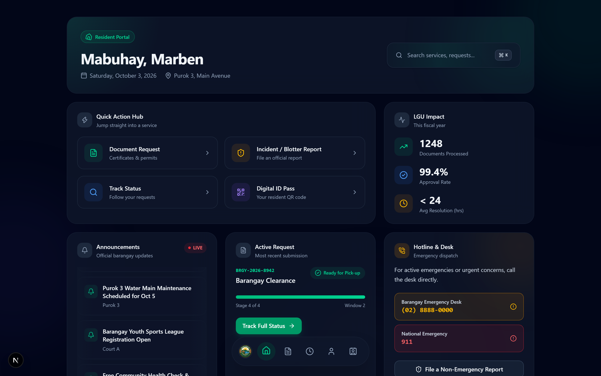
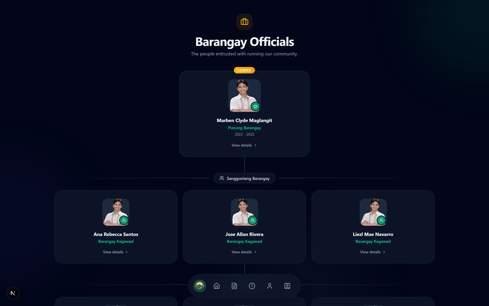
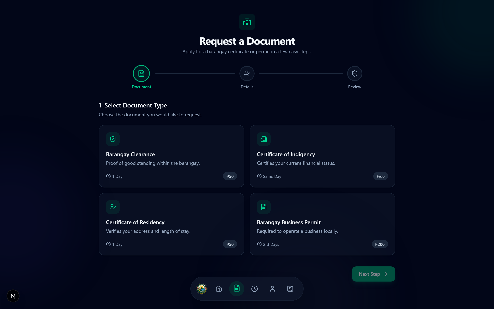
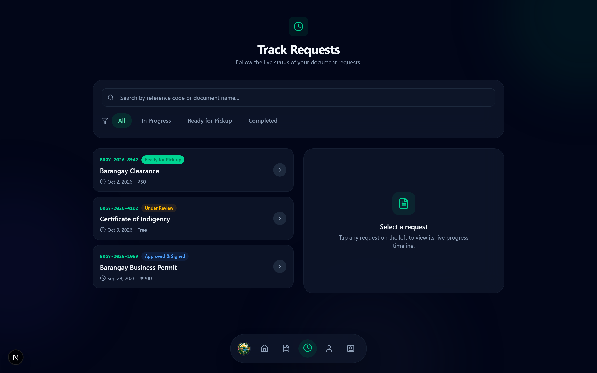
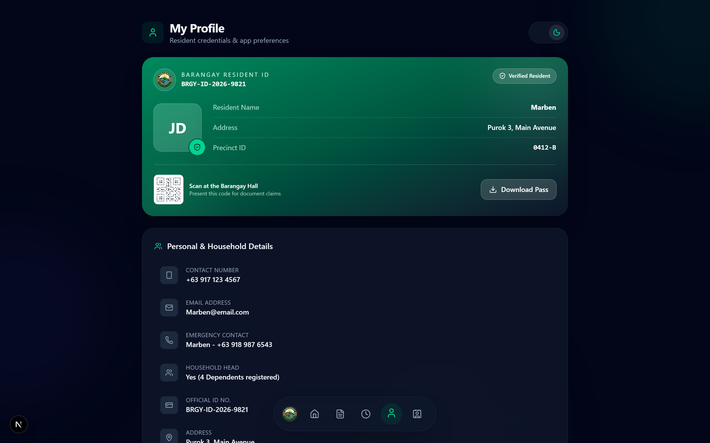
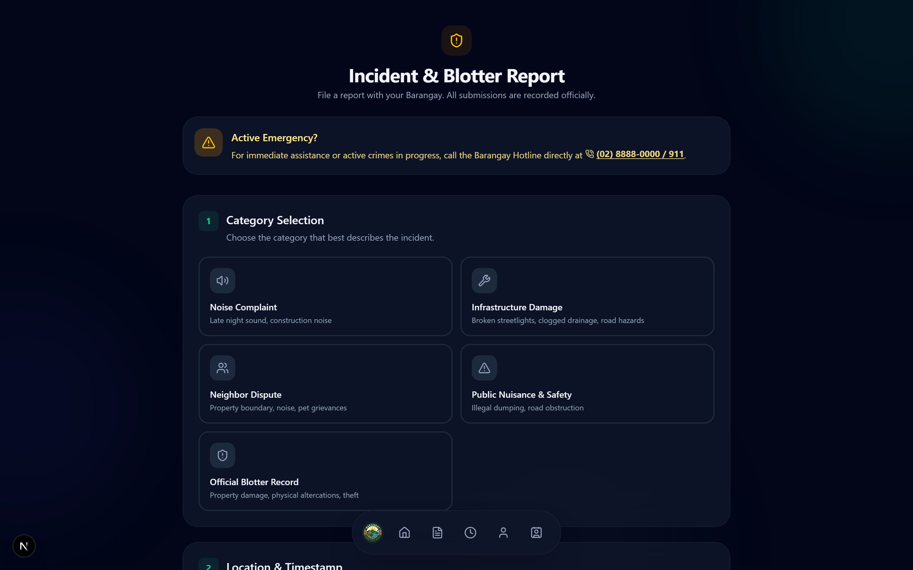
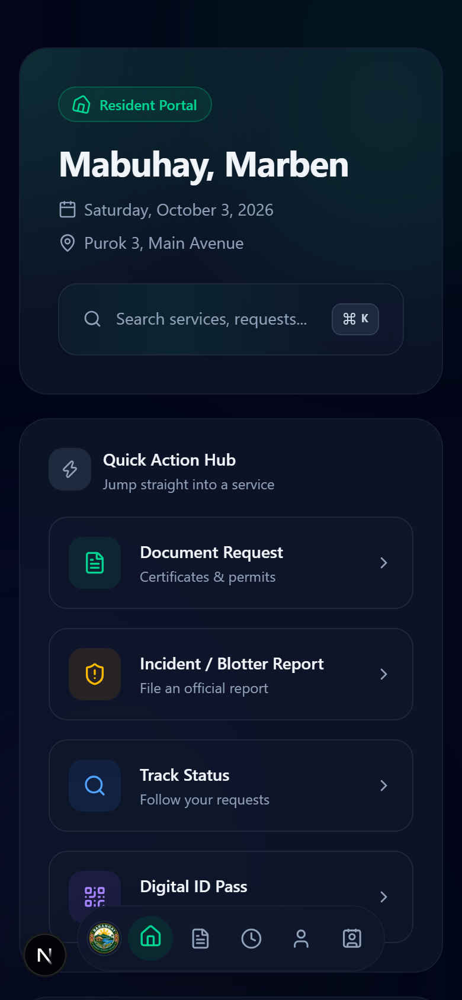

# Barangay Resident Portal

A modern resident-facing portal for barangay services - document requests,
incident reporting, request tracking, and an officials directory.

Built as a **front-end showcase** with Next.js 15, React 19, and TypeScript.
The UI leans on glassmorphic surfaces, ambient gradients, and Framer Motion
for shared-element transitions and micro-interactions.

> **Status:** Front-end only. All data is mocked in-module and resets on
> refresh - this is a portfolio/demo build, not a production system. See
> [Scope](#scope-what-is-and-isnt-real).

---

## Live demo

**https://barangay.myappmcb.workers.dev**

Deployed to Cloudflare Workers via OpenNext. Sign in with any email and
password - the form accepts everything and redirects straight to the
dashboard.

> Sign-in is a front-end mock (see [Scope](#scope-what-is-and-isnt-real)),
> so there is no account to create and nothing is submitted anywhere.

---

## Screenshots

| | |
| --- | --- |
|  |  |
| Cinematic login - slideshow, 3D tilt card | Bento dashboard - quick actions, live stats, hotline |
|  |  |
| Officials directory - org chart | Document request - step 1 of 4 |
|  |  |
| Request tracking with filters | Resident ID pass and household details |
|  |  |
| Incident & blotter reporting | Mobile layout with floating nav dock |

Full-resolution captures live in [`docs/screenshots/`](docs/screenshots).

---

## Highlights

**Cinematic login** - crossfading Pexels slideshow with a scrim tuned for
text contrast, a mouse-driven 3D tilt card, and sliding-label inputs.

**Bento dashboard** - spotlight hero that tracks the cursor, 3D tilt action
cards, animated number tickers, an infinite announcement marquee, a stylized
SVG barangay map with radar-pulse pins, and a month-grid community calendar.

**Multi-step document request** - four animated stages with a spring-driven
stepper, live validation, and a generated reference code.

**Request tracking** - searchable and filterable list, a four-stage vertical
timeline, and a digital pick-up pass.

**Incident and blotter reporting** - category selection, location and
timestamp capture, evidence upload, and a certification step before filing.

**Officials directory** - a three-tier organizational chart with connector
lines, portraits, and per-official detail modals.

**Ambient code stream** - code lines that fade in near the cursor while it
moves over empty background.

### Design system

- Dark mode is the **default** for first visitors, with a pre-hydration
  script that prevents any flash of the wrong theme
- Glassmorphic card tokens shared across every route
- Full `prefers-reduced-motion` support - ambient effects and 3D tilt
  disable themselves
- Two fonts only (system sans + monospace) - **no web fonts downloaded**

---

## Tech stack

| Layer | Choice |
| --- | --- |
| Framework | Next.js 15 (App Router) |
| UI runtime | React 19 |
| Language | TypeScript (strict) |
| Styling | Tailwind CSS v4 via `@tailwindcss/postcss` |
| Animation | Framer Motion |
| Icons | lucide-react |
| Class merging | `clsx` + `tailwind-merge` |
| Hosting | Cloudflare Workers via OpenNext |

---

## Getting started

Requires **Node.js 20+** (developed on v24).

```bash
npm install      # install dependencies
npm run dev      # dev server at http://localhost:3000
npm run build    # production build
npm run lint     # lint
npx tsc --noEmit # type check
```

### Deploying to Cloudflare

The repo is configured for Cloudflare Workers through the OpenNext adapter:
`wrangler.jsonc` holds the worker entry, `nodejs_compat` flag and asset
binding; `open-next.config.ts` holds the adapter configuration.

```bash
npx wrangler login    # authenticate once
npm run deploy        # build + deploy
```

For GitHub-connected builds, set the Workers Builds command to
`npm run deploy` and leave the deploy command and output directory unset.

### Asset optimization

Source images in `assets/` are print-resolution and far too large to ship.
`scripts/optimize-images.mjs` resizes each to about 2x its largest rendered
size and re-encodes as WebP:

```bash
node scripts/optimize-images.mjs
```

Served assets total roughly **55 KB**, down from 3.8 MB.

### A note on `.next`

`next dev` and `next build` both write to `.next`. Running `npm run build`
while the dev server is live will overwrite the files it is serving, and the
browser receives HTML where it expects JS/CSS. If that happens: stop the dev
server, delete `.next`, restart.

---

## Routes

| Route | Description |
| --- | --- |
| `/` | Redirects to `/login` |
| `/login` | Mock sign-in; sets a session cookie |
| `/dashboard` | Bento dashboard: quick actions, stats, map, calendar |
| `/services` | Four-step document request flow |
| `/track` | Request list, stage timeline, QR pick-up pass |
| `/reports` | Incident and blotter reporting form |
| `/officials` | Barangay officials directory |
| `/profile` | Digital ID card, preferences, sign out |
| `/contact` | Developer profile and contact form |

---

## Project structure

```
src/
  app/
    layout.tsx            Root layout, ambient orbs, theme script
    globals.css           Tailwind v4 entry, shimmer keyframes
    login|dashboard|services|track|reports|officials|profile|contact/
  components/
    AmbientCodeStream.tsx Cursor-reactive code lines
    BarangayMap.tsx       Stylized SVG map with interactive pins
    BottomNav.tsx         Floating dock with shared-element active pill
    CommunityCalendar.tsx Month grid with event modal
    Skeleton.tsx          Theme-aware skeleton primitives
  hooks/
    useAsyncData.ts       Loading-state wrapper for future API calls
  lib/
    auth.ts               Route-protection middleware
    utils.ts              cn() class-name helper
  middleware.ts           Wires auth into Next
scripts/
  optimize-images.mjs     One-off asset optimizer
```

---

## Scope: what is and is not real

**Real:** routing, responsive layout, theming, animation, the component
architecture, and the route protection in `src/lib/auth.ts`.

**Not real:** every piece of data. Requests, officials, and events are module
constants. Form submissions simulate latency then discard the input. Signing
in sets a client-side cookie.

> **The route protection is not security.** Anyone can set the cookie by hand.
> Its purpose is to stop residents wandering into internal pages by typing
> URLs. When a backend exists, replace the cookie check in `src/lib/auth.ts`
> with a server-side session lookup.

`src/hooks/useAsyncData.ts` exists so the loading states are real and testable
today. Swap the loader body for a `fetch` call and the `isLoading` contract
stays the same.

---

## Local-only files

`.clinerules` and everything under `assets/` except the logo are ignored via
`.gitignore` - local tooling config and private source material.
